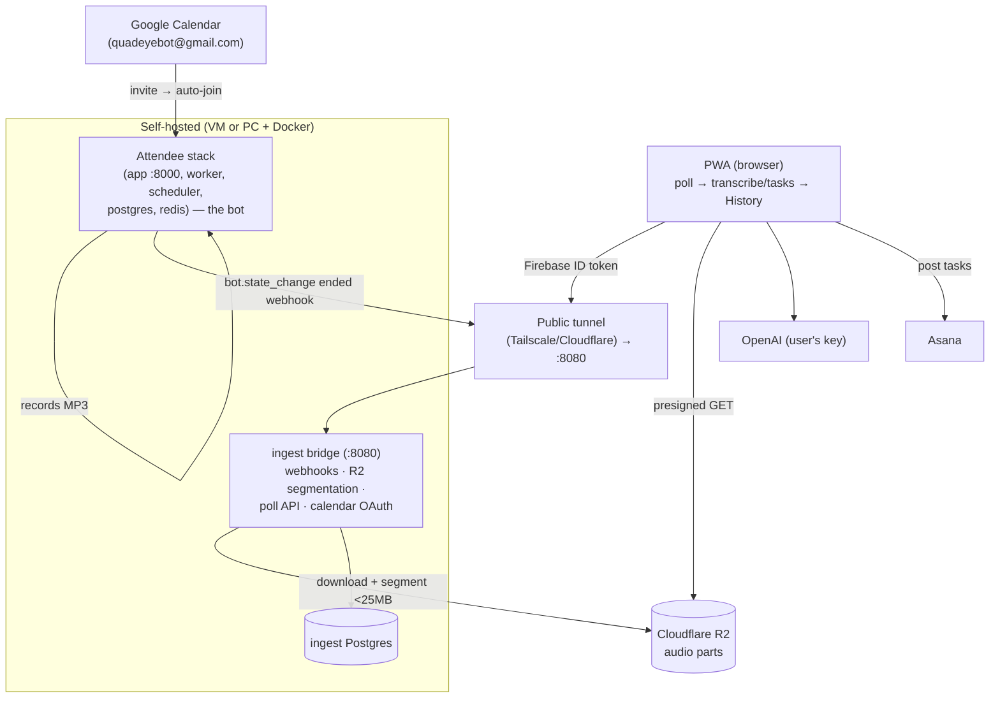
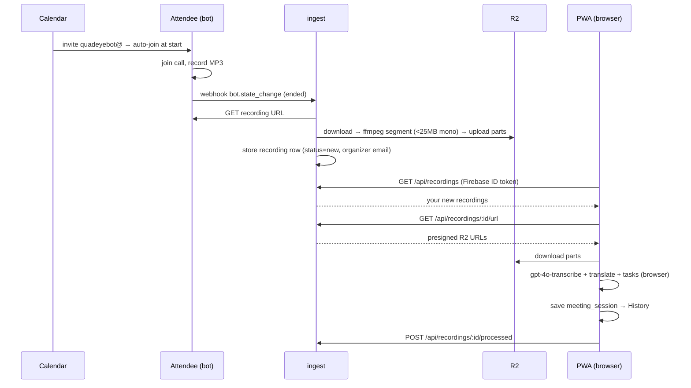

# Meeting Bots — Backend + PWA Integration (Overview)

> Audience: reviewers / seniors. Crisp by design. Scope: **Part 1** the `bots/` backend (Attendee + our `ingest` bridge), **Part 2** the integration in the PWA (`PWA/project-manager`). Deep dive: `[internals.md](internals.md)`.
>
> Net-new on top of `project-manager @ 7d7ca0c` (the PWA "Add meeting bot ingest and recording processing" work).

---

## The problem

The in-app recorder and the browser extension both need **someone to be in the meeting** capturing audio. But often nobody wants to keep a tab open, or the meeting has no human notetaker. We want a **bot that joins the Meet/Zoom call on its own**, records it, and drops the result into the app's History — ready to become Asana tasks.

## The decision (how we picked the approach)

Adding Google Meet + Zoom bot capture had three options:


| Option                                      | How                                             | Flaw                                                         | Tool                                                                  |
| ------------------------------------------- | ----------------------------------------------- | ------------------------------------------------------------ | --------------------------------------------------------------------- |
| **1. Self-hosted bot** (chosen for `bots/`) | Free; a bot joins as an **invitee**             | Needs a **server** (Docker + proxies + webhooks)             | **Attendee** (needs Postgres + Redis + Docker)                        |
| **2. Hosted SaaS bot**                      | No server to run; bot joins as invitee          | **Paid** (charged for hosting + storing/transcribing)        | Vexa / Recall                                                         |
| **3. Extension pipeline** (the free path)   | No server; runs **our** pipeline in the browser | Only captures **meetings you attend**; uses our own pipeline | The Chrome extension (auth + key handled as a mini-app under the PWA) |


We chose **Option 1 (Attendee, self-hosted)** for the bot backend documented here — free and fully under our control — and keep **Option 3 (extension)** as the zero-infra path for meetings you're already in. Option 2 was rejected as a paid dependency.

> Crucial cost lever in Option 1: the backend **only joins + records + serves audio**. **Transcription/tasks run in the user's browser** with their own OpenAI key (same pipeline as the live recorder) — so the server has no AI cost.

---

## What it does (features & usage)


| Feature                     | How the user uses it                                                                                                                  |
| --------------------------- | ------------------------------------------------------------------------------------------------------------------------------------- |
| **Auto-join from calendar** | Invite `**quadeyebot@gmail.com`** to a Meet/Zoom event → the bot auto-joins at start time and records.                                |
| **Send bot on demand**      | Paste a Meet/Zoom link in the PWA ("Send the notetaker to a meeting") → the bot joins that instant meeting.                           |
| **Auto-process in the PWA** | Open the PWA → it polls for your new recordings, transcribes/translates/extracts tasks **in your browser**, and saves to **History**. |
| **Attribution**             | You only ever see **your own** recordings (matched by organizer email against your signed-in account).                                |


---

## Architecture




## End-to-end flow




---

## Run the demo

Bring up both compose stacks + a tunnel (full steps in `bots/deploy/RUNBOOK.md`):

```powershell
# Attendee (the bot)
cd bots\attendee-src ; docker compose -f dev.docker-compose.yaml up -d
# our ingest + its db
cd ..\ ; docker compose up -d --build
# public tunnel → ingest :8080
tailscale funnel --bg 8080
# PWA
cd ..\PWA\project-manager ; npm run dev
```

One-time: open `<PUBLIC_URL>/calendars/google/auth` signed in as the bot account to connect its calendar. Then:

1. Invite `quadeyebot@gmail.com` to a Meet, **or** paste the link in the PWA's "Send bot" box.
2. Let the bot join + record; end the call.
3. Open the PWA → watch the floating "Processing…" indicator → the meeting appears in **History** with tasks → post to Asana.

Smoke-test the ingest alone (no Docker/Postgres/Firebase): `STORE_BACKEND=memory DEV_AUTH_BYPASS=true npm run smoke` in `bots/ingest`.

---

## Results

- **Hands-off capture** — invite the bot (or paste a link) and the meeting shows up in History with action items; nobody has to keep a tab open.
- **Zero server AI cost** — the backend only joins/records/serves; all transcription + tasks run in the user's browser with their own key (same engine as the live recorder), so infra stays cheap.
- **Private + attributed** — audio lives in R2, served via short-lived presigned URLs; the API returns only recordings whose organizer email matches the Firebase-verified caller.
- **Free & self-owned** — Attendee self-hosted beats the paid SaaS bots; the extension remains the no-infra fallback for meetings you attend.

---

## Status & limitations (headlines)

- Dev-grade today: **runs on a PC + Docker + Tailscale Funnel**; the PC/tunnel must be up for the bot to work. Productionizing → a VM + real domain + Caddy (see the RUNBOOK checklist).
- **Zoom external meetings** need Zoom Marketplace approval of the OAuth app; Google Meet needs none.
- Recording consent/notice is a legal must in many places.
- **OpenAI is the dominant cost** and is per-user (browser key).

Full API, decisions, edge cases, file-by-file, and the PWA integration internals are in `[internals.md](internals.md)`.