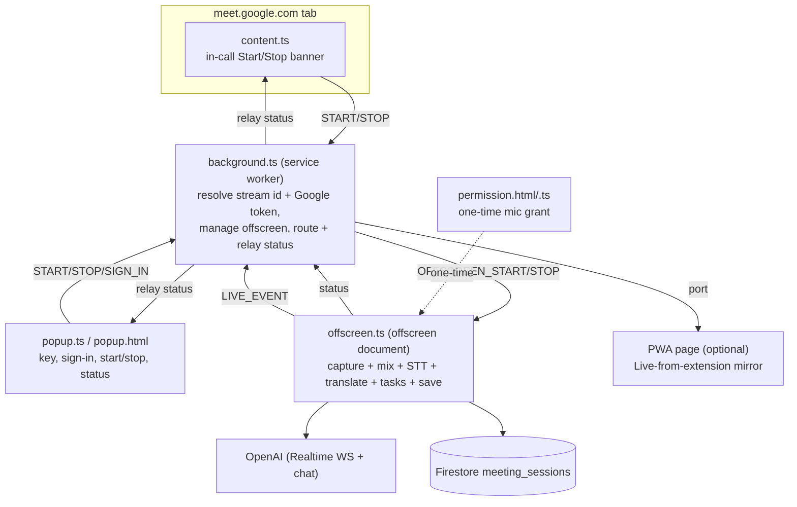

# Meeting → Tasks Notetaker (Chrome Extension) — Overview

> Audience: reviewers / seniors. Crisp by design. Scope: **only** the browser extension under `project-manager-extension/extension/` (and the small PWA-side bridge it talks to). Deep dive: [`internals.md`](internals.md).
>
> This is net-new work on top of the `project-manager @ 7d7ca0c` baseline (the "extension package & pwa integration" line of commits).

---

## The problem

The in-app **Meeting → Tasks** recorder captures **your mic**. But in a real **Google Meet**, the important audio is **the other participants**, coming out of the tab — a web page can't grab another tab's audio. We also don't want to force people to keep a separate recorder tab in focus.

**Goal:** a one-click **Chrome extension** that captures the **Meet tab audio + your mic**, transcribes/translates/extracts tasks with the **same engine as the PWA**, and drops the result straight into the shared **`meeting_sessions`** History — so a captured Meet shows up in the app ready to post to Asana. It must run **independently of the PWA** (the app can be closed) and optionally **mirror live** into an open PWA page.

---

## Features & usage

| Feature | What it does |
|---|---|
| **One-click capture** | Popup **or** an in-call banner on `meet.google.com` starts/stops the notetaker. |
| **Tab + mic mix** | Captures the other participants (tab audio) **and** your voice (mic), mixed — you still hear the call, no echo. |
| **Same AI pipeline as the PWA** | Realtime Whisper STT + gpt-4o translate + gpt-5.4-mini task extraction (shared code — identical behaviour). |
| **Writes to History** | Saves the session (English transcript + tasks + cost) to the app's `meeting_sessions`, under the same Google account, ready to post to Asana from the PWA. |
| **Runs independently** | The PWA can be closed; results are read from Firestore later. |
| **Live mirror (optional)** | An open PWA "Live from extension" page can stream the capture live and take over saving. |
| **TEST_MODE** | Skips Google/Firebase entirely; runs the full OpenAI pipeline and saves the result to `chrome.storage.local` + a downloadable JSON — for quick quality testing with only an OpenAI key. |

Usage: load `extension/dist` unpacked → popup → **Enable microphone** (once) → paste **OpenAI key** → (full mode) **Sign in with Google** → open a Meet → **Start** → talk → **Stop & save**.

---

## Architecture (MV3)



Why four pieces: MV3 **service workers can't capture audio or use the DOM**, so the heavy work runs in an **offscreen document**; the **content script** provides the in-call banner; the **popup** is the config surface; the **background** brokers everything (only it can read `chrome.storage`, resolve the tab stream id, and get a Google token).

## Capture → tasks flow

```mermaid
sequenceDiagram
  participant U as User
  participant BG as background
  participant OFF as offscreen
  participant AI as OpenAI
  participant FS as Firestore
  U->>BG: Start (popup / banner)
  BG->>BG: get tab streamId + Google token + OpenAI key
  BG->>OFF: OFFSCREEN_START(streamId, token, key)
  OFF->>OFF: capture tab+mic → mix → 24kHz PCM
  OFF->>AI: realtime Whisper (verbatim Hinglish)
  loop every 15s
    OFF->>AI: gpt-4o translate (Roman+English)
    OFF->>AI: gpt-5.4-mini task extract (rolling window)
  end
  loop every 30s
    OFF->>FS: checkpoint session
  end
  U->>BG: Stop
  BG->>OFF: OFFSCREEN_STOP
  OFF->>AI: final flush + reconcile
  OFF->>FS: save session → History
```

---

## Run the demo (TEST_MODE — no Firebase/Google)

`extension/src/config.ts` ships `TEST_MODE = true`.

```powershell
cd project-manager-extension
npm install
npm run build:ext         # esbuild → extension/dist
# chrome://extensions → Developer mode → Load unpacked → extension/dist
```

1. Popup → **Enable microphone** (allow once).
2. Popup → paste your **OpenAI API key** → **Save key**.
3. Open a Google Meet → **Start** (popup or in-call banner) → talk → **Stop & save**.
4. Popup → **Download last capture (JSON)** to see transcript + tasks (or the offscreen console).

For real History writes, set `TEST_MODE = false` and do the one-time Firebase + Google OAuth setup (see `internals.md`).

---

## Results

- **Captures the meeting that matters** — the other participants (tab) + you (mic), which a plain web page cannot do.
- **Zero-friction** — one click from the in-call banner; no separate recorder tab to babysit; the PWA can be closed.
- **Consistent output** — reuses the PWA's exact STT/translate/task code, so a captured Meet is indistinguishable in History from an in-app recording, and is immediately postable to Asana.
- **Stable identity** — a pinned extension ID means OAuth is registered once and the same `dist` works on every machine.
- **Testable in minutes** — TEST_MODE runs the whole AI pipeline with just an OpenAI key and hands back a downloadable JSON.

---

## Status & limitations (headlines)

- **Google Meet only** for now; **Chrome 116+** (MV3 offscreen + `tabCapture`).
- **Muting in Meet doesn't stop your capture** (own mic stream) — only an OS mic mute or Stop does.
- Presenter's **shared screen audio** isn't in the tab stream, so it isn't captured.
- `TEST_MODE = true` currently — flip it + configure OAuth/Firebase for History writes.
- The OpenAI key lives in the browser (per-user, on device).

Full protocol, decisions, edge cases, and file-by-file walk in [`internals.md`](internals.md).
