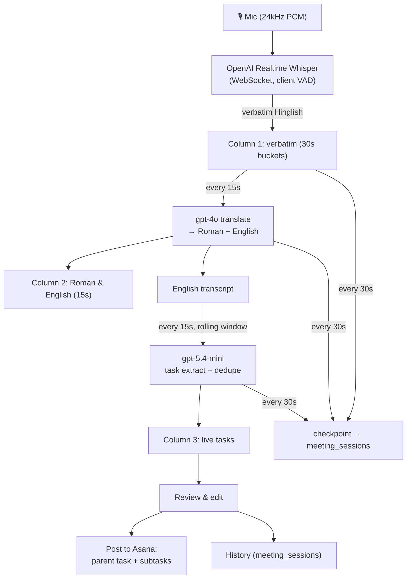
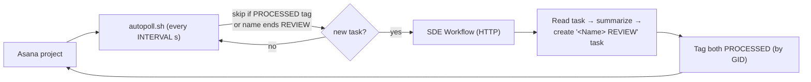
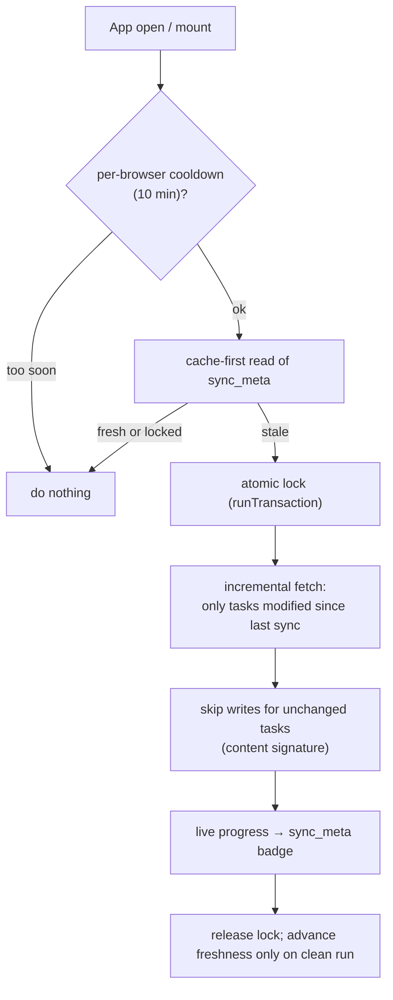

# Project Manager — Meeting→Tasks, Autopoller/SDE & Asana Sync (Overview)

> Audience: reviewers / seniors. Crisp by design. Scope: the **`project-manager-extension`** repo — the **Meeting → Tasks** page, the **Autopoller + SDE review** pipeline, and the **Asana sync fix**. The browser-extension capture path is intentionally **out of scope** here. Deep dive: [`internals.md`](internals.md).
>
> Baseline for all "what changed" framing is **`project-manager @ 7d7ca0c`** (the starting point).

---

## The problem

The team runs projects out of **Asana**, but two gaps hurt:

1. **Meetings don't become tasks.** Standups happen in **Hinglish**; action items get lost or hand-typed into Asana later. We had a separate recorder app (DelegateAI) but it lived outside the project-management tool.
2. **The dashboard kept blowing the Firestore quota.** The app mirrors Asana into Firestore so the dashboard/pods/progress views are fast. But every page load re-read whole collections, and every open kicked a full Asana→Firestore sync — repeatedly hitting **resource-exhausted (429)** and leaving stale/blank data.

This piece solves both: it **migrates the meeting recorder into the Project Manager app** as a live "Meeting → Tasks" page, adds an **Autopoller + SDE** review pipeline on top of Asana, and **fixes the Asana sync** so it's incremental, locked, throttled, and cache-first.

---

## Three features at a glance

| Feature | What it does |
|---|---|
| **Meeting → Tasks page** | Record a meeting in-browser → live Hinglish transcript → live English + task extraction → review → **post to Asana** (parent task + subtasks). Saved to **History** for later review/posting. |
| **Autopoller + SDE workflow** | A polling script watches an Asana project and, for each new task, triggers an autonomous **SDE review** agent that summarizes the meeting task and files a companion `… REVIEW` task — with tag-based loop prevention. |
| **Asana sync fix** | The Asana→Firestore mirror is now incremental (only changed tasks), single-locked, heartbeated, throttled per-browser, cache-first, and skips unchanged writes — killing the quota-exhaustion problem. |

---

## Migration: from the old recorder to this page

The Meeting→Tasks page is a **migration** of the earlier standalone **DelegateAI recorder** into the Project Manager app, re-architected to run **entirely in the browser**:

| | Old recorder (DelegateAI) | This page (project-manager) |
|---|---|---|
| Transcription | Google **Gemini**, server-side (Cloud Functions) | **OpenAI Realtime Whisper**, in-browser, **live** |
| Translate + tasks | Gemini, server-side, after upload | **gpt-4o** (translate) + **gpt-5.4-mini** (tasks), live in-browser |
| Timing | batch (upload whole file, then process) | **realtime** (transcript, English + tasks appear as you talk) |
| Storage | `meetings` + Cloud Storage audio | `meeting_sessions` (transcript + tasks; no audio kept) |
| Asana | server, one task + subtasks | **browser**, parent meeting task + a subtask per action item |

---

## How the Meeting → Tasks page works



- **Three live columns:** verbatim transcript (30s buckets) · Roman + English (15s buckets) · live tasks (rolling-window dedup). You can inject manual transcript lines and manual tasks live.
- **Auto-safety:** the screen is kept awake, the meeting auto-ends at **60 minutes** (with an alarm), and the session is **checkpointed every 30s** so a crash/refresh doesn't lose it.
- **Review → Asana:** edit tasks + assignees, then post. A **parent** meeting task (title = meeting name, notes = English transcript) is created in the configured Asana project, and each enabled task becomes a **subtask**. Everything lands in **History** for re-posting later.

## Autopoller + SDE review pipeline



`autopoll.sh` polls one Asana project; each new, unprocessed task triggers an autonomous **SDE review** agent that reads the task, writes a concise summary, creates a companion **`<Name> REVIEW`** task (same project/assignee), and tags both `PROCESSED`. Three loop guards (PROCESSED tag, `REVIEW` suffix, in-memory cache) stop it re-processing.

## Asana sync (the fix)



The mirror is now **incremental** (Asana `modified_since`), **single-locked** with a heartbeat, **throttled per browser** and **cache-first**, and **skips unchanged writes**. Firestore also uses a **persistent local cache**, so reloads resume instead of re-reading whole collections.

---

## Run the demo

```powershell
cd project-manager-extension
npm install
# .env: VITE_FIREBASE_*, VITE_ASANA_* , VITE_ASANA_PAT (local dev), VITE_MEETING_ASANA_* , VITE_DISABLE_AUTO_SYNC=1 (optional)
npm run dev
```

Demo script:
1. Sign in → connect Asana (local dev can use `VITE_ASANA_PAT`).
2. Open **Meeting → Tasks**, paste your OpenAI key (stored on-device), press the big mic.
3. Talk Hinglish → watch verbatim, Roman/English, and live tasks fill the three columns.
4. **Stop** → **Review** → edit → **Post to Asana** → confetti + a link to the parent task.
5. Open **History** → reopen the session → add/post more tasks later.
6. Watch the **sync badge** in the sidebar show incremental progress / "ok/total latest".

---

## Results

- **Meetings become Asana tasks in one sitting** — live Hinglish transcript + English + deduped action items, posted as a parent task with subtasks, all in the browser (no server, no audio stored).
- **Resilient recording** — 30s checkpoints, 60-min auto-stop, wake-lock, and a Stop path that never hangs (timeouts + background writes).
- **Quota problem fixed** — incremental `modified_since` fetches, unchanged-write skipping, one locked run at a time, per-browser cooldown, cache-first reads, and IndexedDB persistence collapse the Firestore reads/writes that were causing `resource-exhausted`. The sidebar badge shows live progress and per-project failures instead of silent staleness.
- **Review automation** — the Autopoller/SDE pipeline turns raw meeting tasks into reviewed companion tasks without manual triage, with tag-based loop safety.

---

## Status & non-goals

- **In scope:** mic-based Meeting→Tasks, Autopoller/SDE, Asana sync fix.
- **Out of scope (excluded here):** the browser-extension capture source (a second, optional capture path) — documented separately.
- Everything is framed against the **`7d7ca0c`** baseline; the sync internals and file-by-file walk are in [`internals.md`](internals.md).
