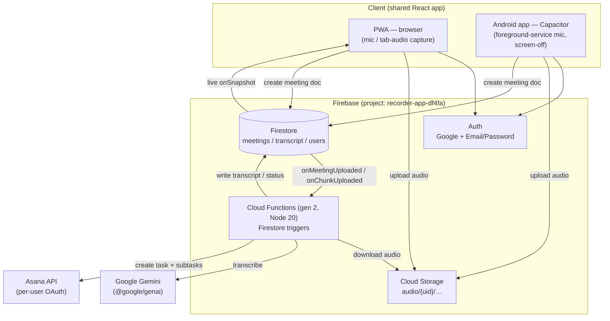
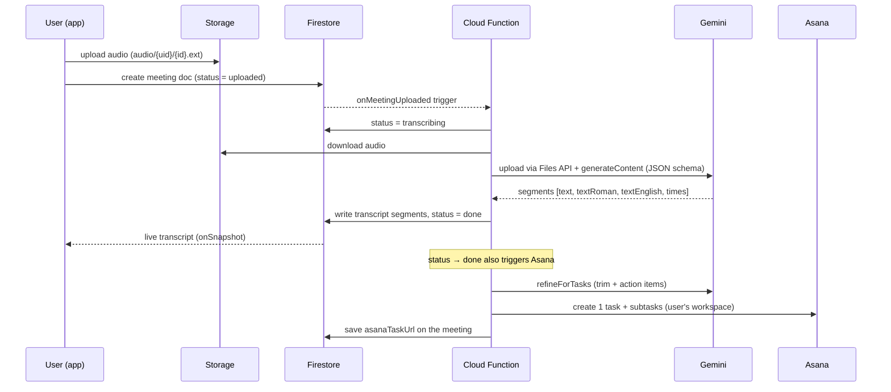
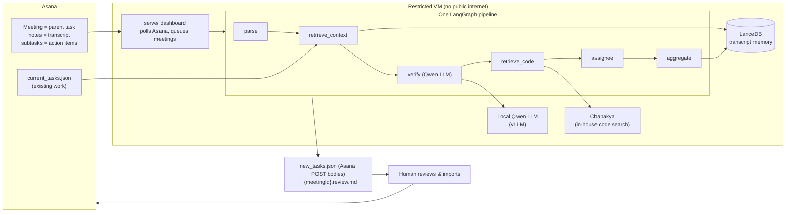

# DelegateAI — Overview

> Audience: reviewers / seniors. Crisp by design. For the deep dive (design justifications, edge cases, tech-stack versions, file-by-file flow) see [`internals.md`](internals.md).

DelegateAI has two halves:

1. **DelegateAI Recorder** — the app I built: a cross-platform PWA + Android app that records meetings, transcribes them, and turns them into Asana tasks.
2. **DelegateAI Brain** — a companion pipeline that runs inside a **restricted VM (DCV)** with no public internet. It takes the meeting's action items and refines them into reviewed, codebase-aware Asana tasks. (Documented here from its spec; its code lives in the secure environment.)

This doc covers the Recorder in full and summarises how it hands off to the Brain.

---

## The problem

Our meetings are in **Hinglish** (Hindi + English, code-switched). After every meeting, action items are lost or manually re-typed into Asana. Existing tools:

- don't handle **code-switched Hindi/English** well,
- either **leak audio/transcripts** to third-party SaaS, or need a laptop kept awake, and
- stop at a transcript — they don't produce **actionable, assigned tasks**.

**Goal:** record a meeting on any device (even a phone with the screen off), get an accurate Hinglish transcript, and auto-create a clean Asana task with subtasks — while keeping the AI key server-side and each user's data scoped to them.

---

## Features & usage

| Feature | What the user does | Result |
|---|---|---|
| **Record (offline)** | Tap record on phone/desktop | Mic audio captured, uploaded, transcribed |
| **Record (online)** | Pick "online", share the meeting tab | Tab audio (+ optional mic) mixed and recorded |
| **Long meeting** | Toggle "Long meeting" before recording | Audio auto-split into ~10-min chunks, each transcribed while you keep recording; merged at the end |
| **Import** | Upload an audio file or a transcript (`.txt`/`.json`) | Same transcription + task pipeline runs |
| **Transcript** | Open a meeting | Live status; each line shown as **verbatim / romanized / English** |
| **Asana** | Connect Asana once (OAuth) | Every finished meeting becomes one Asana task + action-item subtasks in *your* workspace |
| **Admin** | Admin account | Read/search/export **everyone's** transcripts as JSON |
| **Install** | "Add to Home Screen" / sideload APK | Installable PWA; Android app records with screen off |

Languages default to Hindi + English. The transcript is always produced in three forms so a reader can pick verbatim, readable Hinglish, or a full English translation.

---

## Architecture



Key point: **the browser never calls the AI directly.** The client only writes to Storage + Firestore; a Firestore **trigger** does the transcription and Asana work server-side, so the Gemini key never reaches the client and it works even under org policies that block public function endpoints.

---

## How it works (flow)



- **Long meetings** follow the same path per chunk (`onChunkUploaded`), then a client-requested **merge** stitches all chunk transcripts (timestamps offset) into the main transcript.
- **Retry** just resets the meeting/chunk status, which re-fires the trigger.

---

## The Brain (restricted VM)

The Recorder gets us a meeting + first-pass action items in Asana. But those items are raw ("fix the PNL crash") — they aren't verified, de-duplicated, grounded in the actual codebase, or checked against work we already have. The **Brain** is the second pass that does exactly that — and it must run **inside a restricted VM (DCV) with no public internet**, because our source code can never leave that boundary.

> This section is summarised from the Brain's spec (`DelegateAI/BRAIN.md`); its code lives in the secure VM, not in this repo.

### What it solves
- **Noise & duplicates:** the same ask raised twice, or a vague non-task, shouldn't become two tickets.
- **No grounding:** an action item means little without the **files** it touches and the **prior/related work**.
- **Security:** grounding needs the codebase — which cannot be sent to any third-party AI. So the "smart" step uses only **internal services** (a local LLM + our in-house code search), fully offline and auditable. **Nothing is auto-exported — a human approves.**

### How it works



**Three inputs → reviewed tasks out:**
- **Meeting export** (this meeting's conversation + pre-generated subtasks) + the **archive** of past meetings (as searchable memory).
- **Current Asana tasks** (to find related / duplicate work).
- **Codebase** (file-level references, via Chanakya — only the minimal task text is sent, never code).

**The 6-step pipeline:** `parse` (split owners, merge near-duplicates) → `retrieve_context` (related prior meetings + existing tasks) → **`verify`** (the local Qwen LLM keeps / revises / splits / drops each task with a relevance score, and infers who each speaker is) → `retrieve_code` (Chanakya file refs) → `assignee` (a definite name from the transcript, else `common`) → `aggregate` (write the Asana task bodies + a human-readable `review.md`, then file this meeting into memory). Only *verify* uses the LLM and *retrieve_code* uses Chanakya; everything else is deterministic.

### Results
- Each output task is an **import-ready Asana POST body** whose notes carry **full, auditable provenance**: the LLM verdict + relevance score, the grounding conversation lines, the **file-level code references**, and any related prior task.
- A companion **`{meetingId}.review.md`** lets a human read every task's basis and edit before importing.
- Long standups stay bounded: consolidating duplicates, skipping non-code items, and clustering similar items keep the (slow) code-lookup step to a handful of calls; transcript memory is month-bucketed with a rolling window so the index never grows unbounded.

The full pipeline internals, config knobs, and retention math are in [`internals.md`](internals.md) §8.

---

## Run the demo

Prereqs: Node 20+, a Firebase project, a Gemini API key. (Full setup in the repo `DelegateAI/README.md`.)

```bash
# 1. Frontend
cd DelegateAI/web
cp .env.example .env      # fill VITE_FIREBASE_* (safe to expose)
npm install
npm run dev               # http://localhost:5173  (talks to live Firebase)

# 2. Backend (once)
cd ../functions && npm install
firebase functions:secrets:set GEMINI_API_KEY   # server-side only
firebase deploy --only functions,firestore,storage
```

Demo script:
1. Sign in (Google or email/password).
2. **Record** a short Hinglish clip → **Stop** → **Submit**.
3. Watch the meeting go `uploaded → transcribing → done` live.
4. See the transcript in verbatim / roman / English.
5. (Optional) Connect Asana first, then the finished meeting shows an **Asana task** link with subtasks.

To demo **screen-off recording**, sideload the debug APK (`DelegateAI-debug.apk`) and record with the phone locked.

> To make yourself **admin**: in Firestore, set your `users/{uid}.role` to `admin` — then the Admin page lists everyone's meetings.

---

## Results

What the system actually delivers today:

| Outcome | Result |
|---|---|
| **Hinglish transcript** | Every meeting produces an ordered, speaker-labelled transcript in **three forms per line** — verbatim (Devanagari + English), romanized Hinglish, and full English — from a single Gemini call. |
| **Action items → Asana** | A finished meeting auto-creates **one Asana task + N subtasks** in the owner's own workspace, with a cleaned, condensed dialogue as the description (noise/filler stripped). |
| **Long meetings** | Hour-long meetings are handled by ~10-min checkpoint chunking that transcribes **while you record** and merges at the end — no single giant call, progress visible mid-meeting. |
| **Screen-off capture** | The Android app records with the **screen locked / app backgrounded** via a foreground service — a plain website cannot do this. |
| **Cross-device** | Same React codebase runs as an installable PWA (desktop + mobile) and a sideloadable Android APK. |
| **Security posture** | Gemini key stays **server-side**; each user only sees their own meetings/audio; admins can read/export everyone's. Verified by Firestore/Storage rules. |
| **Resilience** | Transient Gemini outages (503 "high demand"/429) are absorbed by a retry + model-fallback chain, turning failures into slower successes; any meeting/chunk is one-click retryable. |

> Transcription quality is qualitative today (no formal WER benchmark yet). A labelled Hinglish eval set to produce hard accuracy numbers is listed under *Future stages* in the internals doc.

---

## Status & limitations (headlines)

- **Chunk speaker labels** aren't reconciled across chunks (a "Speaker 1" in chunk 2 may differ from chunk 1).
- **iOS Safari** stops recording on screen lock — the Android app solves this with a foreground service.
- **Online (tab-audio) mode** is desktop Chrome/Edge only.
- Cost is dominated by **Gemini usage**, not infra.

Full reasoning, edge cases, and the roadmap are in [`internals.md`](internals.md).
