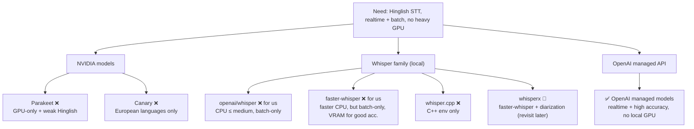
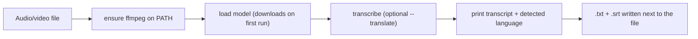

# Audio STT Models — Evaluation & Selection (Overview)

> Audience: reviewers / seniors. Crisp by design. Deep dive (per-model reasoning, code walk, versions, full cost model) is in [`internals.md`](internals.md).

This piece documents **how we chose the speech-to-text (STT) stack** for the meeting recorder. We started by testing **local, self-hosted** models (anchored in the `whisper local/` folder), found they couldn't meet our needs, and moved to **OpenAI's managed models**. This is the evidence and the decision.

---

## The problem

We need to transcribe **Hinglish** (code-switched Hindi + English) meetings, in two modes:

1. **Live / realtime** — captions and transcript while the meeting happens (browser extension + PWA).
2. **Batch** — process a finished recording (the meeting-bot's audio file).

Requirements: good **Hinglish** accuracy (including technical terms), **realtime capability** for the live mode, and **no heavy local GPU** dependency (users are on laptops/phones). So we benchmarked the field before committing.

---

## Candidates & why most were dropped



- **NVIDIA — Parakeet:** rejected — runs on **GPUs only** and is **weak on Hinglish**.
- **NVIDIA — Canary:** rejected — trained on **European languages only** (no good Hindi/Hinglish).
- **Whisper family (local):** viable accuracy at larger sizes but **batch-only** (no true realtime) and good accuracy needs **VRAM** — see Results. `whisper.cpp` is C++-only; `whisperx` (faster-whisper + diarization) is parked for later.

---

## What we built to test (features & usage)

Two small local CLIs (in `whisper local/`) to benchmark the Whisper family on our own audio:

| Tool | Backend | Use |
|---|---|---|
| `whisper local/transcribe.py` | `openai/whisper` (PyTorch) | `python transcribe.py meeting.mp3 --model medium --language hi` |
| `whisper local/faster-whisper/transcribe.py` | `faster-whisper` (CTranslate2) | `python transcribe.py meeting.mp3 --model medium --device cpu --compute-type int8` |

Both write `.txt` + `.srt`, support `--language` and `--task translate`, and ship a one-command smoke test (`test/run_test.py`) that auto-generates a spoken clip via Windows TTS.

---

## Run the demo

```powershell
# openai/whisper (needs system ffmpeg)
cd "whisper local"
pip install -r requirements.txt
python test\run_test.py --model small          # smoke test
python transcribe.py "test\audio\meeting.mp3" --model medium --language hi

# faster-whisper (no system ffmpeg needed; CPU int8)
cd faster-whisper
pip install -r requirements.txt
python transcribe.py "test\audio\meeting.mp3" --model medium --compute-type int8
```

---

## How it works (flow)



Local models are **batch only**: they take a whole file and return the transcript — there is no live-streaming path. That single fact is what pushed us to the managed API for the live mode.

---

## Results

Scored on our Hinglish audio (subjective /10). **All local runs are batch-only — none can do realtime.**

| Model | Backend | Score | Notes |
|---|---|---|---|
| `base` | openai/whisper | **0/10** | very poor — unusable on Hinglish |
| `medium` | openai/whisper | **9/10** | accurate but **slow** on CPU |
| `small` | faster-whisper | **6/10** | misses **critical/technical terms** |
| `medium` | faster-whisper | **9/10** | accurate but needs **~4 GB VRAM** |

**Takeaway:** good local accuracy is achievable (`medium`, 9/10) but only at the cost of **slow CPU runs or a ~4 GB GPU**, and **never realtime**. That doesn't fit laptop/phone users or the live-captions requirement.

### Decision → OpenAI managed models

| Model | Role | Why | ~Cost / 1-hr meeting |
|---|---|---|---|
| **gpt-realtime-whisper** | Live STT (streaming deltas) | The only option giving **realtime** transcript for the extension/PWA live mode | **~$1.02** ($0.017/min) |
| **gpt-4o-transcribe** | Batch/file STT | **Higher accuracy** for the meeting-bot's recorded files | **~$0.36** ($0.006/min) |
| **gpt-4o** | Translate + action-item extraction (LLM) | Turns the Hinglish transcript into English + concrete tasks | **~$0.15–0.30** (token-based) |
| **gpt-4o-mini** (a.k.a. the cheaper mini LLM) | Low-cost LLM pass | Cheap romanize/translate/task passes where top quality isn't needed | **~$0.01–0.03** (token-based) |

**Net:** a **live** 1-hour meeting ≈ **~$1.20–1.50** (realtime STT + LLM); a **batch** bot recording ≈ **~$0.50** (file STT + LLM). No local GPU, realtime where we need it, and best-in-class Hinglish accuracy.

> Cost figures are estimates at July-2026 OpenAI rates; the token-based LLM numbers depend on transcript length and how often action items are re-extracted. Full assumptions + math in [`internals.md`](internals.md).

---

## Status

- **Chosen:** gpt-realtime-whisper (live) + gpt-4o-transcribe (batch) + gpt-4o / mini (LLM post-processing).
- **Parked:** `whisperx` for local **diarization** if we ever need speaker labels offline.
- **Rejected:** NVIDIA Parakeet/Canary; local Whisper for production (kept only as an offline/testing fallback).
